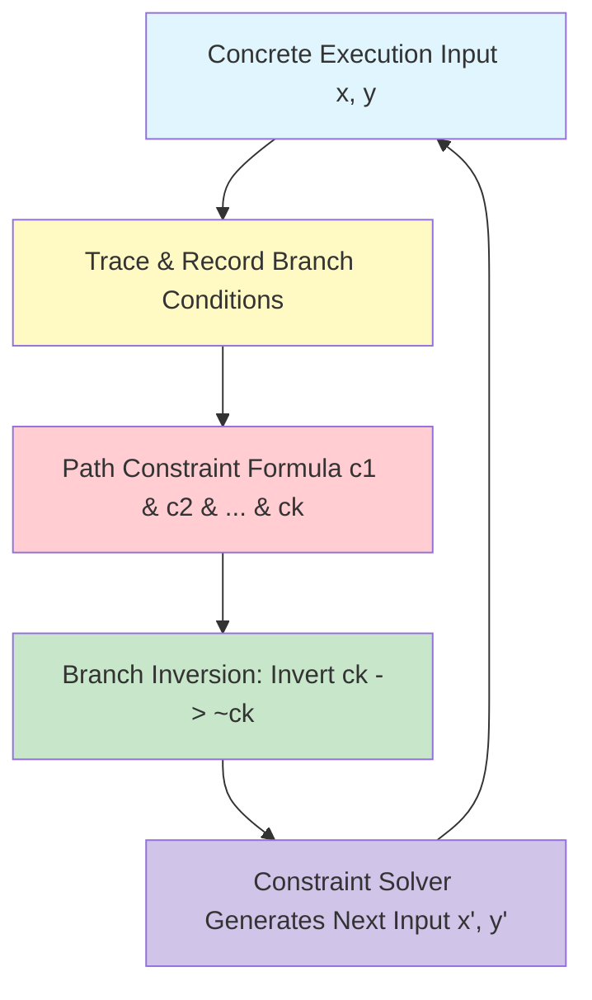

# GenPark Concolic Execution Branch Inverter Skill

Concolic testing and symbolic branch inversion engine recording concrete-symbolic execution paths.

Learn more at [GenPark](https://genpark.ai) and the [GenPark MCP Catalog](https://genpark.ai/mcp).

## Features
- Dynamic branch decision logging along concrete agent execution paths.
- Systematic branch inversion targeting 100% path coverage.
- Pure Python standard library.
